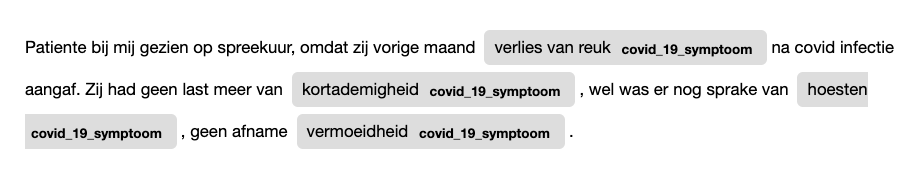

# clinlp

[](https://github.com/umcu/clinlp/actions/workflows/test.yml)
[](https://clinlp.readthedocs.io/en/latest/?badge=latest)
[](https://pypi.org/project/clinlp/)
[](https://pypi.org/project/clinlp/)
[](https://github.com/umcu/clinlp/blob/main/LICENSE)
[](https://spacy.io/)
[](https://github.com/astral-sh/ruff)


<!-- start_intro_line_1 -->
* :hospital: `clinical` + :netherlands: `nl` + :clipboard: `NLP` = :sparkles: `clinlp`
<!-- start_intro_line_2 -->
* :star: NLP tools and algorithms for clinical text written in Dutch
<!-- start_intro_line_3 -->
* :triangular_ruler: Organized in a standardized but flexible framework using `spaCy`
<!-- start_intro_line_4 -->
* :rocket: Production-ready, performant, well-tested and easy to use
<!-- start_intro_line_5 -->
* :bulb: Free, open source, created and maintained by the Dutch Clinical NLP community
<!-- end_intro_lines -->

## Contact

If you have questions, need help getting started, found a bug, or have a feature request, please don't hesitate to [contact us](https://clinlp.readthedocs.io/en/latest/contributing.html#contact)!

## Getting started

### Installation

```bash
pip install clinlp
```

### Example

```python
import spacy
from clinlp.ie import Term

nlp = spacy.blank("clinlp")

# Normalization
nlp.add_pipe("clinlp_normalizer")

# Sentences
nlp.add_pipe("clinlp_sentencizer")

# Entities
terms = {
    "prematuriteit": [
        "preterm", "<p3", "prematuriteit", "partus praematurus"
    ],
    "hypotensie": [
        "hypotensie", Term("bd verlaagd", proximity=1)
    ],
    "veneus_infarct": [
        "veneus infarct", Term("VI", attr="TEXT")
    ]
}

entity_matcher = nlp.add_pipe("clinlp_rule_based_entity_matcher", config={"attr": "NORM", "fuzzy": 1})
entity_matcher.add_terms_from_dict(terms)

# Qualifiers
nlp.add_pipe("clinlp_context_algorithm", config={"phrase_matcher_attr": "NORM"})

text = (
    "Preterme neonaat (<p3) opgenomen, bd enigszins verlaagd, familieanamnese vermeldt eveneens hypotensie "
    "bij moeder. Thans geen aanwijzingen voor veneus infarkt wat ook geen "
    "verklaring voor de partus prematurus is. Risico op VI blijft aanwezig."
)

doc = nlp(text)
```

Find information in the `Doc` object:

```python
from spacy import displacy

displacy.render(doc, style="span", options={'spans_key': 'ents'})
```



With relevant qualifiers (defaults omitted for readability):

```python
for ent in doc.spans["ents"]:
  print(ent, ent._.qualifiers_str)
```

* `Preterme` `set()`
* `<p3` `set()`
* `bd enigszins verlaagd` `set()`
* `hypotensie` `{'Experiencer.Family'}`
* `veneus infarkt` `{'Presence.Absent'}`
* `partus prematurus` `set()`
* `VI` `{'Temporality.Future'}`

## Documentation

The full documentation can be found at [https://clinlp.readthedocs.io](https://clinlp.readthedocs.io).

## Links

* [Documentation](https://clinlp.readthedocs.io)
* [Contributing guidelines](https://clinlp.readthedocs.io/en/latest/contributing.html)
* [API](https://clinlp.readthedocs.io/en/latest/api/api.html)
* [`clinlp` development roadmap](https://github.com/orgs/umcu/projects/3)
* [Create an issue](https://github.com/umcu/clinlp/issues/new/choose)
* [Cite `clinlp`](https://clinlp.readthedocs.io/en/latest/citing.html)
* [Changelog](https://clinlp.readthedocs.io/en/latest/changelog.html)
