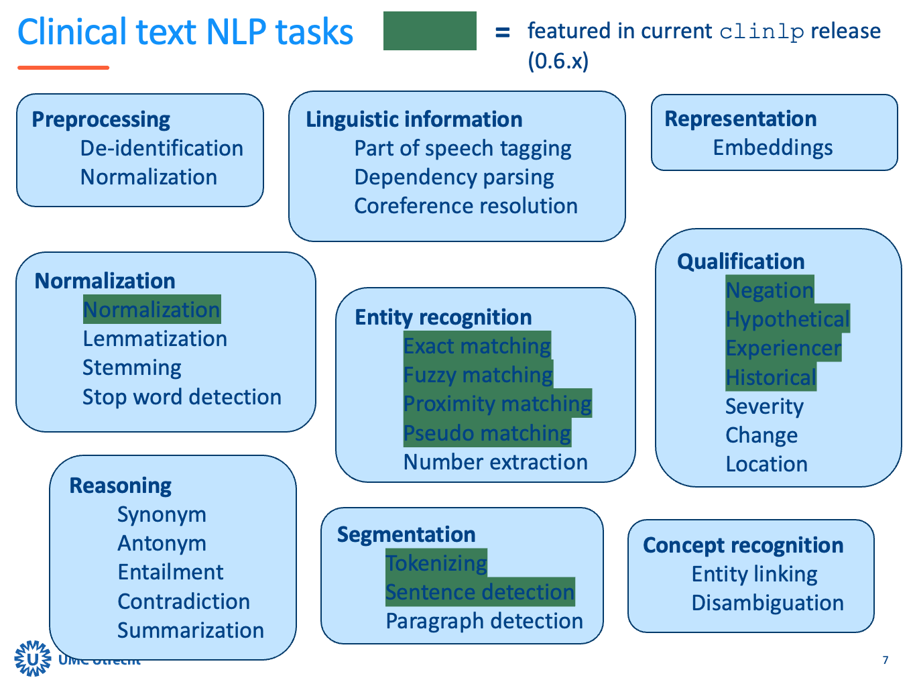

[](https://github.com/umcu/clinlp/actions/workflows/test.yml)
[](https://pypi.org/project/clinlp/)
[](https://pypi.org/project/clinlp/)
[](https://github.com/umcu/clinlp/blob/main/LICENSE)
[](https://github.com/astral-sh/ruff)

# clinlp


* :hospital: `clinical` + :netherlands: `nl` + :clipboard: `NLP` = :sparkles: `clinlp`
* :star: Performant and production-ready NLP pipelines for clinical text written in Dutch
* :rocket: Open source, created and maintained by the Dutch Clinical NLP community
* :triangular_ruler: Useful out of the box, but customization highly recommended

If you are enthusiastic about using or contributing to `clinlp`, please don't hesitate to get in touch (via [e-mail](mailto:analytics@umcutrecht.nl) or by creating an [issue](https://github.com/umcu/clinlp/issues/new)). `clinlp` is intended as a community project, and we would love to hear from you. 

This readme contains information on [getting started](#getting-started), how to [cite](#citing) this work, some basic [documentation](#documentation), the [roadmap](#roadmap), the overarching [principles and goals](#principles-and-goals) and how to [contribute](#contributing) :arrow_down:.

## Getting started

### Installation
```bash
pip install clinlp
```

### Example
```python
import spacy
from clinlp.ie import Term

nlp = spacy.blank("clinlp")

# Normalization
nlp.add_pipe("clinlp_normalizer")

# Sentences
nlp.add_pipe("clinlp_sentencizer")

# Entities
concepts = {
    "prematuriteit": [
        "preterm", "<p3", "prematuriteit", "partus praematurus"
    ],
    "hypotensie": [
        "hypotensie", Term("bd verlaagd", proximity=1)
    ],
    "veneus_infarct": [
        "veneus infarct", Term("VI", attr="TEXT")
    ]
}

entity_matcher = nlp.add_pipe("clinlp_entity_matcher", config={"attr": "NORM", "fuzzy": 1})
entity_matcher.load_concepts(concepts)

# Qualifiers
nlp.add_pipe("clinlp_context_algorithm", config={"phrase_matcher_attr": "NORM"})

text = (
    "Preterme neonaat (<p3), bd enigszins verlaagd, familieanamnese vermeldt eveneens hypotensie "
    "bij moeder. Thans geen aanwijzingen voor veneus infarkt wat ook geen "
    "verklaring voor de partus prematurus is. Risico op VI blijft aanwezig."
)

doc = nlp(text)
```

Find information in the doc object:

```python
from spacy import displacy

displacy.render(doc, style="ent")
```


With relevant qualifiers (defaults omitted for readability):

```python
for ent in doc.ents:
  print(ent, ent._.qualifiers_str)
```

* `Preterme` `set()`
* `<p3` `set()`
* `bd enigszins verlaagd` `set()`
* `hypotensie` `{'Experiencer.Family'}`
* `veneus infarkt` `{'Presence.Absent'}`
* `partus prematurus` `set()`
* `VI` `{'Temporality.Future'}`

## Citing

If you use `clinlp`, please find the appropriate citation by clicking the Zenodo button below. This should always point you to the current latest release:

[](https://doi.org/10.5281/zenodo.10528055)

## Documentation

### Introduction

`clinlp` is built on top of spaCy, a widely used library for Natural Language Processing. Before getting started with `clinlp`, it may be useful to read [spaCy 101: Everything you need to know (~10 mins)](https://spacy.io/usage/spacy-101). Main things to know are that spaCy consists of a tokenizer (breaks a text up into small pieces, i.e. words), and various components that further process the text. 

Currently, `clinlp` offers the following components, tailored to Dutch Clinical text, further discussed below: 

1. [Tokenizer](#tokenizer)
2. [Normalizer](#normalizer)
3. [Sentence splitter](#sentence-splitter)
4. [Entity matcher](#entity-matcher)
5. [Qualifier detection (negation, historical, etc.)](#qualifier-detection)
    - [Context Algorithm](#context-algorithm)
    - [Transformer based detection](#transformer-based-detection)
6. [Metrics and statistics](#metrics-and-statistics)

### Tokenizer

The `clinlp` tokenizer is built into the blank model:

```python
nlp = spacy.blank("clinlp")
```

It employs some custom rule based logic, including:
- Clinical text-specific logic for splitting punctuation, units, dosages (e.g. `20mg/dag` :arrow_right: `20` `mg` `/` `dag`)
- Custom lists of abbreviations, units (e.g. `pt.`, `zn.`, `mmHg`)
- Custom tokenizing rules (e.g. `xdd` :arrow_right: `x` `dd`)
- Regarding [DEDUCE](https://github.com/vmenger/deduce) tags as a single token (e.g. `[DATUM-1]`). 
  - Deidentification is not builtin `clinlp` and should be done as a preprocessing step.

### Normalizer

The normalizer sets the `Token.norm` attribute, which can be used by further components (entity matching, qualification). It currently has two options (enabled by default):
- Lowercasing
- Removing diacritics, where possible. For instance, it will map `ë` :arrow_right: `e`, but keeps most other non-ascii characters intact (e.g. `µ`, `²`).

Note that this component only has effect when explicitly configuring successor components to match on the `Token.norm` attribute. 

### Sentence splitter

The sentence splitter can be added as follows:

```python
nlp.add_pipe("clinlp_sentencizer")
```

It is designed to detect sentence boundaries in clinical text, whenever a character that demarks a sentence ending is matched (e.g. newline, period, question mark). It also correctly detects items in an enumerations (e.g. starting with `-` or `*`). 

### Entity matcher

`clinlp` includes a `clinlp_entity_matcher` component that can be used for matching entities in text, based on a dictionary of known concepts and their terms/synonyms. It includes options for matching on different token attributes, proximity matching, fuzzy matching and matching pseudo/negative terms. 

The most basic example would be the following, with further options described below:

```python
concepts = {
    "sepsis": [
        "sepsis",
        "lijnsepsis",
        "systemische infectie",
        "bacteriemie",
    ],
    "veneus_infarct": [
        "veneus infarct",
        "VI",
    ]
}

entity_matcher = nlp.add_pipe("clinlp_entity_matcher")
entity_matcher.load_concepts(concepts)

```
> :bulb: The `clinlp_entity_matcher` component wraps the spaCy `Matcher` and `PhraseMatcher` components, adding some convenience and configurability. However, the `Matcher`, `PhraseMatcher` or `EntityRuler` can also be used directly with `clinlp` for those who prefer it.

#### Attribute

Specify the token attribute the entity matcher should use as follows (by default `TEXT`):

```python
entity_matcher = nlp.add_pipe("clinlp_entity_matcher", config={"attr": "NORM"})
```

Any [Token attribute](https://spacy.io/api/token#attributes) can be used, but in the above example the `clinlp_normalizer` should be added before the entity matcher, or the `NORM` attribute is simply the literal text. `clinlp` does not include Part of Speech tags and dependency trees, at least not until a reliable model for Dutch clinical text is created, though it's always possible to add a relevant component from a trained (general) Dutch model if needed.

#### Proximity matching

The proxmity setting defines how many tokens can optionally be skipped between the tokens of a pattern. With `proxmity` set to `1`, the pattern `slaapt slecht` will also match `slaapt vaak slecht`, but not `slaapt al weken slecht`. 

```python
entity_matcher = nlp.add_pipe("clinlp_entity_matcher", config={"proximity": 1})
```

#### Fuzzy matching

Fuzzy matching enables finding misspelled variants of terms. For instance, with `fuzzy` set to `1`, the pattern `diabetes` will also match `diabets`, `ddiabetes`, or `diabetis`, but not `diabetse` or `ddiabetess`. The threshold is based on Levenshtein distance with insertions, deletions and replacements (but not swaps).  

```python
entity_matcher = nlp.add_pipe("clinlp_entity_matcher", config={"fuzzy": 1})
```

Additionally, the `fuzzy_min_len` argument can be used to specify the minimum length of a phrase for fuzzy matching. This also works for multi-token phrases. For example, with `fuzzy` set to `1` and `fuzzy_min_len` set to `5`, the pattern `bloeding graad ii` would also match `bloedin graad ii`, but not `bloeding graad iii`. 

```python
entity_matcher = nlp.add_pipe("clinlp_entity_matcher", config={"fuzzy": 1, "fuzzy_min_len": 5})
```

#### Terms
The settings above are described at the matcher level, but can all be overridden at the term level by adding a `Term` to a concept, rather than a literal phrase:

```python
from clinlp.ie import Term

concepts = {
    "sepsis": [
        "sepsis",
        "lijnsepsis",
        Term("early onset", proximity=1),
        Term("late onset", proximity=1),
        Term("EOS", attr="TEXT", fuzzy=0),
        Term("LOS", attr="TEXT", fuzzy=0)
    ]
}

entity_matcher = nlp.add_pipe("clinlp_entity_matcher", config={"attr": "NORM", "fuzzy": 1})
entity_matcher.load_concepts(concepts)
```

In the above example, by default the `NORM` attribute is used, and `fuzzy` is set to `1`. In addition, for the terms `early onset` and `late onset` proximity matching is set to `1`, in addition to matcher-level config of matching the `NORM` attribute and fuzzy matching. For the `EOS` and `LOS` abbreviations the `TEXT` attribute is used (so the matching is case sensitive), and fuzzy matching is disabled. 

#### Pseudo/negative phrases

On the term level, it is possible to add pseudo or negative patterns, for those phrases that need to be excluded. For example:

```python
concepts = {
    "prematuriteit": [
        "prematuur",
        Term("prematuur ademhalingspatroon", pseudo=True),
    ]  
}
```

In this case `prematuur` will be matched, but not in the context of `prematuur ademhalingspatroon` (which may indicate prematurity, but is not a definitive diagnosis).

#### Spacy patterns

Finally, if you need more control than literal phrases and terms as explained above, the entity matcher also accepts [spaCy patterns](https://spacy.io/usage/rule-based-matching#adding-patterns). These patterns do not respect any other configurations (like attribute, fuzzy, proximity, etc.):

```python
concepts = {
    "delier": [
        Term("delier", attr="NORM"),
        Term("DOS", attr="TEXT"),
        [
             {"NORM": {"IN": ["zag", "ziet", "hoort", "hoorde", "ruikt", "rook"]}},
             {"OP": "?"},
             {"OP": "?"},
             {"OP": "?"},
             {"NORM": {"FUZZY1": "dingen"}},
             {"OP": "?"},
             {"NORM": "die"},
             {"NORM": "er"},
             {"OP": "?"},
             {"NORM": "niet"},
             {"OP": "?"},
             {"NORM": {"IN": ["zijn", "waren"]}}
        ],
    ]
}
```

#### Concept dictionary from external source

When matching entities, it is possible to load external lists of concepts (e.g. from a medical thesaurus such as UMLS) from `csv` through the `create_concept_dict` function. Your `csv` should contain a combination of concept and phrase on each line, with optional columns to configure the `Term`-options described above (e.g. `attribute`, `proximity`, `fuzzy`). You may present the columns in any order, but make sure the names match the `Term` attributes. Any other columns are ignored. For example:

| **concept** | **phrase** | **attr** | **proximity** | **fuzzy** | **fuzzy_min_len** | **pseudo** | **comment** |
|--|--|--|--|--|--|--|--|
| prematuriteit | prematuriteit | | | | | | some comment |
| prematuriteit | <p3 | | 1 | 1 | 2 | |
| hypotensie | hypotensie |
| hypotensie | bd verlaagd | | 1 |
| veneus_infarct | veneus infarct |
| veneus_infarct | VI | TEXT |

Will result in the following concept dictionary:

```python
{
    "prematuriteit": [
        "prematuriteit",
        Term("<p3", proximity=1, fuzzy=1, fuzzy_min_len=2),
    ],
    "hypotensie": [
        "hypotensie",
        Term("bd verlaagd", proximity=1)
    ],
    "veneus_infarct": [
        "veneus infarct",
        Term("VI", attr="TEXT")
    ]
}
```

### Qualifier detection

After finding entities, it's often useful to qualify these entities, e.g.: are they present or absent, historical or current? `clinlp` currently implements two options: the rule-based Context Algorithm, and a transformer-based negation detector. In both cases, the result can be found in the `entity._.qualifiers`, `entity._.qualifiers_dict` and `entity._.qualifiers_str` attributes (including all defaults, e.g. `Present` for `Presence`). Some clarifications on the framework we use for qualifiers is available under [docs/qualifiers.docx](docs/qualifiers.docx) (will be incorporated in an improved documentation page soon).

#### Context Algorithm

The rule-based [Context Algorithm](https://doi.org/10.1016%2Fj.jbi.2009.05.002) is fairly accurate, and quite transparent and fast. A set of rules, that checks for presence, temporality, and experiencer, is loaded by default:

```python
nlp.add_pipe("clinlp_context_algorithm", config={"phrase_matcher_attr": "NORM"})
```

A custom set of rules, including different types of qualifiers, can easily be defined. See [`src/clinlp/resources/context_rules.json`](src/clinlp/resources/context_rules.json) for an example, and load it as follows:

```python
cm = nlp.add_pipe("clinlp_context_algorithm", config={"rules": "/path/to/my_own_ruleset.json"})
```

#### Transformer based detection

`clinlp` also includes a wrapper around some trained transformer models for detector qualifiers, including the negation detector described in [van Es et al, 2022](https://doi.org/10.48550/arxiv.2209.00470). The underlying transformers can be found on [huggingface](https://huggingface.co/UMCU/). The negation detector for instance is reported as more accurate than the rule-based version (see paper for details), at the cost of less transparency and additional computational cost.

First, install the additional dependencies:

```bash
pip install "clinlp[transformers]"
```

Currently, the following components are available:

```python
_ = nlp.add_pipe("clinlp_negation_transformer")
_ = nlp.add_pipe("clinlp_experiencer_transformer")
```

Some configuration options, like the number of tokens to consider, can be specified in the `config` argument. 

#### Using multiple qualifier detectors together

Multiple qualifier detectors (e.g. `clinlp_context_algorithm` and `clinlp_negation_transformer`) can be used together. However, if there is a qualifier class (e.g. Presence) they both detect, the the component that is added last will erase any qualifiers set by previous detectors, regardless of defaults. It's therefore most efficient to configure different detectors to not detect the same qualifiers, although no errors occur. If the qualifier detectors detect different qualifier classes (e.g. one detects Presence, and the other Experiencer), there is no issue and both qualifier classes will be correctly added to the entities.

### Metrics and statistics

`clinlp` can compute some information extraction related metrics and statistics for annotated datasets. This is done by creating one or more `InfoExtractionDataset`. First install the optional dependencies:

```bash
pip install clinlp[metrics]
```

Then:

```python
from clinlp.metrics import InfoExtractionDataset

# medcattrainer
import json

with open('medcattrainer_export.json', 'rb') as f:
    mtrainer_data = json.load(f)

d1 = InfoExtractionDataset.from_medcattrainer(mctrainer_data)

# clinlp
import clinlp
import spacy

from model import get_model  # not included

nlp = get_model()
nlp_docs = nlp.pipe([doc['text'] for doc in data['projects'][0]['documents']])

d2 = InfoExtractionDataset.from_clinlp_docs(nlp_docs)

```

#### Descriptive statistics

Get descriptive statistics for a `Dataset` as follows:

```python
d1.stats()
```

Resulting in:

```python
{'num_docs': 50,
 'num_annotations': 513,
 'span_counts': {'prematuriteit': 43,
                 'infectie': 31,
                 'fototherapie': 25,
                 'dysmaturiteit': 24,
                 'IRDS': 20,
                 'prematuur': 15,
                 'sepsis': 15,
                 'hyperbilirubinemie': 14,
                 'Prematuriteit': 14,
                 'ROP': 13,
                 'necrotiserende enterocolitis': 12,
                 'Prematuur': 11,
                 'infektie': 11,
                 'ductus': 11,
                 'bloeding': 8,
                 'dysmatuur': 7,
                 'IUGR': 7,
                 'Hyperbilirubinemie': 7,
                 'transfusie': 6,
                 'hyperbilirubinaemie': 6,
                 'Dopamine': 6,
                 'wisseltransfusie': 5,
                 'premature partus': 5,
                 'retinopathy of prematurity': 5,
                 'bloedtransfusie': 5},
 'label_counts': {'C0151526_prematuriteit': 94,
                  'C0020433_hyperbilirubinemie': 68,
                  'C0243026_sepsis': 63,
                  'C0015934_intrauterine_groeivertraging': 57,
                  'C0002871_anemie': 37,
                  'C0035220_infant_respiratory_distress_syndrome': 25,
                  'C0035344_retinopathie_van_de_prematuriteit': 21,
                  'C0520459_necrotiserende_enterocolitis': 18,
                  'C0013274_patent_ductus_arteriosus': 18,
                  'C0020649_hypotensie': 18,
                  'C0559477_perinatale_asfyxie': 18,
                  'C0270191_intraventriculaire_bloeding': 17,
                  'C0877064_post_hemorrhagische_ventrikeldilatatie': 13,
                  'C0014850_oesophagus_atresie': 12,
                  'C0006287_bronchopulmonale_dysplasie': 9,
                  'C0031190_persisterende_pulmonale_hypertensie': 7,
                  'C0015938_macrosomie': 6,
                  'C0751954_veneus_infarct': 5,
                  'C0025289_meningitis': 5,
                  'C0023529_periventriculaire_leucomalacie': 2},
 'qualifier_counts': {'Presence': {'Present': 436, 'Uncertain': 34, 'Absent': 30},
                      'Temporality': {'Current': 473, 'Historical': 18, 'Future': 9},
                      'Experiencer': {'Patient': 489, 'Family': 9, 'Other': 2}}}
```

#### Comparison statistics


Create a `InfoExtractionMetrics` object as follows:

```python
from clinlp.metrics import InfoExtractionMetrics

nlp_metrics = InfoExtractionMetrics(d1, d2)

nlp_metrics.entity_metrics()
```

Will result in:
```python
{'ent_type': {'correct': 480,
              'incorrect': 1,
              'partial': 0,
              'missed': 32,
              'spurious': 21,
              'possible': 513,
              'actual': 502,
              'precision': 0.9561752988047809,
              'recall': 0.935672514619883,
              'f1': 0.9458128078817734},
 'partial': {'correct': 473,
             'incorrect': 0,
             'partial': 8,
             'missed': 32,
             'spurious': 21,
             'possible': 513,
             'actual': 502,
             'precision': 0.950199203187251,
             'recall': 0.9298245614035088,
             'f1': 0.9399014778325123},
 'strict': {'correct': 473,
            'incorrect': 8,
            'partial': 0,
            'missed': 32,
            'spurious': 21,
            'possible': 513,
            'actual': 502,
            'precision': 0.9422310756972112,
            'recall': 0.9220272904483431,
            'f1': 0.9320197044334976},
 'exact': {'correct': 473,
           'incorrect': 8,
           'partial': 0,
           'missed': 32,
           'spurious': 21,
           'possible': 513,
           'actual': 502,
           'precision': 0.9422310756972112,
           'recall': 0.9220272904483431,
           'f1': 0.9320197044334976}}
```

For explanation on the different metrics (`partial`, `exact`, `strict` and `ent_type`), see [Nervaluate documentation](https://github.com/MantisAI/nervaluate).

Then, for metrics on qualifiers, use:

```python
nlp_metrics.qualifier_info()
```

Resulting in:

```python
{'Experiencer': {'metrics': {'n': 460,
                             'precision': 0.3333333333333333,
                             'recall': 0.09090909090909091,
                             'f1': 0.14285714285714288},
                 'misses': [{'doc.identifier': 'doc_0001',
                             'annotation': {'text': 'anemie',
                                            'start': 1849,
                                            'end': 1855,
                                            'label': 'C0002871_anemie'},
                             'true_qualifier': 'Family',
                             'pred_qualifier': 'Patient'}, ...]},
 'Temporality': {'metrics': {'n': 460,
                             'precision': 0.0,
                             'recall': 0.0,
                             'f1': 0.0},
                 'misses': [{'doc.identifier': 'doc_0001',
                             'annotation': {'text': 'premature partus',
                                            'start': 1611,
                                            'end': 1627,
                                            'label': 'C0151526_prematuriteit'},
                             'true_qualifier': 'Current',
                             'pred_qualifier': 'Historical'}, ...]},
 'Plausibility': {'metrics': {'n': 460,
                              'precision': 0.6486486486486487,
                              'recall': 0.5217391304347826,
                              'f1': 0.5783132530120482},
                  'misses': [{'doc.identifier': 'doc_0001',
                              'annotation': {'text': 'Groeivertraging',
                                             'start': 1668,
                                             'end': 1683,
                                             'label': 'C0015934_intrauterine_groeivertraging'},
                              'true_qualifier': 'Current',
                              'pred_qualifier': 'Future'}, ...]},
 'Negation': {'metrics': {'n': 460,
                          'precision': 0.7692307692307693,
                          'recall': 0.6122448979591837,
                          'f1': 0.6818181818181818},
              'misses': [{'doc.identifier': 'doc_0001',
                          'annotation': {'text': 'wisseltransfusie',
                                         'start': 4095,
                                         'end': 4111,
                                         'label': 'C0020433_hyperbilirubinemie'},
                          'true_qualifier': 'Present',
                          'pred_qualifier': 'Absent'}, ...]}}
```

### Where to go from here

We hope to extend `clinlp` with new functionality and more complete documentation in the near future. In the meantime, if any questions or problems arise, we recommend:

* Checking the source code 
* Getting in touch ([email](mailto:analytics@umcutrecht.nl) | [issue](https://github.com/umcu/clinlp/issues/new))

## Roadmap

We keep track of work being done on `clinlp` (now and in the future) using GitHub Projects, on this page: [clinlp development roadmap](https://github.com/orgs/umcu/projects/3/views/1). All issues created automatically appear on the roadmap, where they will be triaged and assigned. 

A more high-level overview of the types of NLP tasks that might be implemented in `clinlp`, with those in the current release marked in green, can be found below. This list is non-exhaustive. 



## Principles and goals

Functional:

* Provides NLP pipelines optimized for Dutch clinical text
  * Performant and production-ready
  * Useful out-of-the-box, but highly configurable
* A single place to visit for your Dutch clinical NLP needs
* (Re-)uses existing components where possible, implements new components where needed
* Not intended for annotating, training, and analysis — already covered by existing packages

Development: 

* Free and open source
* Targeted towards the technical user
* Curated and maintained by the Dutch Clinical NLP community
* Built using the [`spaCy`](https://spacy.io/) framework (`>3.0.0`)
  * Therefore non-destructive
* Work towards some level of standardization of components (abstraction, protocols)
* Follows industry best practices (system design, code, documentation, testing, CI/CD)

Overarching goals:

* Improve the quality of Dutch Clinical NLP pipelines
* Enable easier (re)use/valorization of efforts
* Help mature the field of Dutch Clinical NLP
* Help develop the Dutch Clinical NLP community

## Contributing

`clinlp` is intended as a community project, and as such your contribution is very welcome. We hope to set up some more extensive contributing guidelines in the near future. For now, here is some basic information for starters: 

* PRs are welcome, but if you are planning extensive changes, please do get in touch beforehand. This holds both for your own ideas, and for items already on our roadmap. 
* Keep in mind that `clinlp` consists of **generic** components that process **clinical** text written in **Dutch**. If your contribution does not meet those three criteria, a separate release might be a better option. 
* We aim for production ready code, that is well tested, scalable, maintainable, SOLID, etc., but we can help with refactoring code to reach that point. 
* We try to use [issues](https://github.com/umcu/clinlp/issues/new) for communication as much as possible, but you can reach the maintainers by [e-mail](mailto:analytics@umcutrecht.nl) if that doesn't work.
