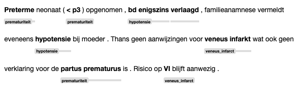

# clinlp


* :hospital: `clinical` + :netherlands: `nl` + :clipboard: `NLP` = :sparkles: `clinlp`
* :star: Performant and production-ready NLP pipelines for clinical text written in Dutch
* :rocket: Open source, created and maintained by the Dutch Clinical NLP community
* :triangular_ruler: Useful out of the box, but customization highly recommended
 

Read the [principles and goals](#principles-and-goals), futher down :arrow_down:

## Contact and contributing

`clinlp` is very much still being shaped, so if you are enthusiastic about using or contributing to `clinlp`, please don't hesitate to get in touch ([email](mailto:analytics@umcutrecht.nl) | [issue](https://github.com/umcu/clinlp/issues/new)). We would be very happy to discuss your ideas and needs, whether its from the perspective of an (end) user, engineer or clinician, and formulate a roadmap with next steps together. 

## Getting started

### Installation
```bash
pip install clinlp
```

### Example
```python
import clinlp
import spacy

nlp = spacy.blank("clinlp")

# Normalization
nlp.add_pipe('clinlp_normalizer')

# Sentences
nlp.add_pipe('clinlp_sentencizer')

# Entities
ruler = nlp.add_pipe('entity_ruler', config={'phrase_matcher_attr': "NORM"})

terms = {
    'covid_19_symptomen': [
        'verkoudheid', 'neusverkoudheid', 'loopneus', 'niezen', 'vermoeidheid',
        'keelpijn', 'hoesten', 'benauwdheid', 'kortademigheid', 'verhoging', 
        'koorts', 'verlies van reuk', 'verlies van smaak'
    ]
}

for term_description, terms in terms.items():
    ruler.add_patterns([{'label': term_description, 'pattern': term} for term in terms])

# Qualifiers
nlp.add_pipe('clinlp_context_algorithm', config={'phrase_matcher_attr': 'NORM'})

text = (
    "Patiente bij mij gezien op spreekuur, omdat zij vorige maand verlies van "
    "reuk na covid infectie aangaf. Zij had geen last meer van kortademigheid, "
    "wel was er nog sprake van hoesten, geen afname vermoeidheid."
)


doc = nlp(text)
```

Find information in the doc object:

```python
from spacy import displacy

displacy.render(doc, style='ent')
```



With relevant qualifiers:

```python
for ent in doc.ents:
  print(ent, ent.start, ent.end, ent._.qualifiers)

```

* `11` `14` `verlies van reuk` `{'Temporality.HISTORICAL'}`
* `25` `26` `kortademigheid` `{'Negation.NEGATED'}`
* `33` `34` `hoesten` `{}`
* `37` `38` `vermoeidheid` `{}`

## Documentation

### Introduction

`clinlp` is built on top of spaCy, a widely used library for Natural Language Processing. Before getting started with `clinlp`, it may be useful to read [spaCy 101: Everything you need to know (~10 mins)](https://spacy.io/usage/spacy-101). Main things to know are that spaCy consists of a tokenizer (breaks a text up into small pieces, i.e. words), and various components that further process the text. 

Currently, `clinlp` offers the following components, tailored to Dutch Clinical text, further discussed below: 

1. [Tokenizer](#tokenizer)
2. [Normalizer](#normalizer)
3. [Sentence splitter](#sentence-splitter)
4. [Entity matcher (builtin Spacy)](#entity-matcher)
5. [Qualifier detection (=context)](#qualifier-detection)
    - [Context Algorithm](#context-algorithm)
    - [Transformer based negation detection](#transformer-based-negation-detection)

### Tokenizer

The `clinlp` tokenizer is built into the blank model:

```python
nlp = spacy.blank('clinlp')
```

It employs some custom rule based logic, including:
- Clinical text-specific logic for splitting punctuation, units, dosages (e.g. `20mg/dag` :arrow_right: `20` `mg` `/` `dag`)
- Custom lists of abbreviations, units (e.g. `pt.`, `zn.`, `mmHg`)
- Custom tokenizing rules (e.g. `xdd` :arrow_right: `x` `dd`)
- Regarding [DEDUCE](https://github.com/vmenger/deduce) tags as a single token (e.g. `[DATUM-1]`). 
  - Deidentification is not builtin `clinlp` and should be done as a preprocessing step.

### Normalizer

The normalizer sets the `token.norm` attribute, which can be used by further components (entity recognition, qualification) for matching. It currently has two options (enabled by default):
- Lowercasing
- Removing diacritings, where possible. For instance, it will map `ë` `->` `e`, but keeps most other non-ascii characters intact (e.g. `µ`, `²`).

Note that this component only has effect when explicitly configuring successor components to match on the `token.norm` attribute. 

### Sentence splitter

The sentence splitter can be added as follows:

```python
nlp.add_pipe('clinlp_sentencizer')
```

It is designed to detect sentence boundaries in clinical text, whenever a character that demarks a sentence ending is matched (e.g. newline, period, question mark). It also correctly detects items in an enumerations (e.g. starting with `-` or `*`). 

### Entity matcher

Currently, the spaCy builtin `PhraseMatcher` and `Matcher` can be used for finding (named) entities in text. The first one accepts literal phrases only, that are matched in the tokenized text, while the second one also accepts [spaCy patterns](https://spacy.io/usage/rule-based-matching#adding-patterns). These are not tailored for the clinical domain, but nevertheless useful when a somewhat coherent list of relevant patterns can be generated/obtained.

For instance, a matcher that helps recognize COVID19 symptoms:

```python
ruler = nlp.add_pipe('entity_ruler', config={'phrase_matcher_attr': "NORM"})

terms = {
    'covid_19_symptomen': [
        'verkouden', 'neusverkouden', 'loopneus', 'niezen', 
        'keelpijn', 'hoesten', 'benauwd', 'kortademig', 'verhoging', 
        'koorts', 'verlies van reuk', 'verlies van smaak'
    ]
}

for term_description, terms in terms.items():
    ruler.add_patterns([{'label': term_description, 'pattern': term} for term in terms])
```

For more info, it's useful to check out these spaCy documentation pages:
* [Rule based matching](https://spacy.io/usage/rule-based-matching)
* [[spaCy API] Matcher](https://spacy.io/api/matcher)
* [[spaCy API] PhraseMatcher](https://spacy.io/api/phrasematcher)

Note that the `DependencyMatcher` cannot be used, and neither are part of speech tags available, as no good models for determining this information for clinical text exist (yet).  

### Qualifier detection

After finding entities, it's often useful to qualify these entities, e.g.: are they negated or affirmed, historical or current? `clinlp` currently implements the rule-based [Context algorithm](https://doi.org/10.1016%2Fj.jbi.2009.05.002), and a [transformer-based negation detector](https://doi.org/10.48550/arxiv.2209.00470). 

#### Context Algorithm

The rule-based Context Algorithm is fairly accurate, and quite transparent and fast. A set of rules, that checks for negation, temporality, plausibility and experiencer, is loaded by default:

```python
nlp.add_pipe('clinlp_context_algorithm', config={'phrase_matcher_attr': 'NORM'})
```

A custom set of rules, including different types of qualifiers, can easily be defined. See [`clinlp/resources/psynlp_context_rules.json`](clinlp/resources/psynlp_context_rules.json) for an example, and load it as follows:

```python
cm = nlp.add_pipe('clinlp_context_algorithm', config={'rules': '/path/to/my_own_ruleset.json'})
```

#### Transformer based negation detection

`clinlp` also includes a wrapper around the transformer based negation detector, as described in [van Es et al, 2022](https://doi.org/10.48550/arxiv.2209.00470). The underlying transformer can be found on [huggingface](https://huggingface.co/UMCU/MedRoBERTa.nl_NegationDetection). It is reported as more accurate than the rule-based version (see paper for details), at the cost of less transparency and additional computational cost.

First, install the additional dependencies:

```bash
pip install "clinlp[transformers]"
```

Then add it using:

```python
tn = nlp.add_pipe('clinlp_negation_transformer')
```

Some configuration options, like the number of tokens to consider, can be specified in the `config` argument. 


### Where to go from here

We hope to extend `clinlp` with new functionality and more complete documentation in the near future. In the meantime, if any questions or problems arise, we recommend:

* Checking the source code 
* Getting in touch ([email](mailto:analytics@umcutrecht.nl) | [issue](https://github.com/umcu/clinlp/issues/new))

## Principles and goals

Functional:

* Provides NLP pipelines optimized for Dutch clinical text
  * Performant and production-ready
  * Useful out-of-the-box, but highly configurable
* A single place to visit for your Dutch clinical NLP needs
* (Re-)uses existing components where possible, implements new components where needed
* Not intended for annotating, training, and analysis — already covered by existing packages

Development: 

* Free and open source
* Targeted towards the technical user
* Curated and maintained by the Dutch Clinical NLP community
* Built using the [`spaCy`](https://spacy.io/) framework (`>3.0.0`)
  * Therefore non-destructive
* Work towards some level of standardization of components (abstraction, protocols)
* Follows industry best practices (system design, code, documentation, testing, CI/CD)

Overarching goals:

* Improve the quality of Dutch Clinical NLP pipelines
* Enable easier (re)use/valorization of efforts
* Help mature the field of Dutch Clinical NLP
* Help develop the Dutch Clinical NLP community
